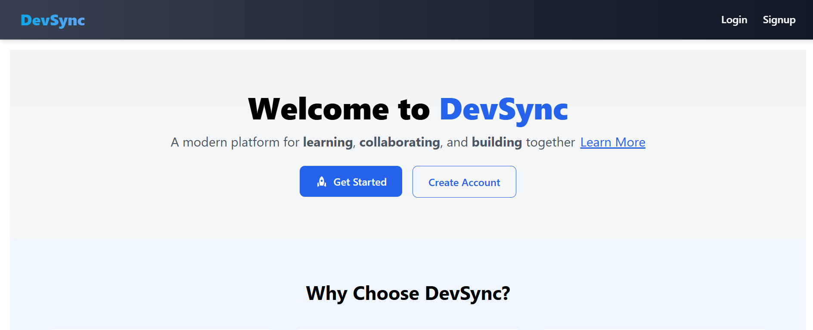
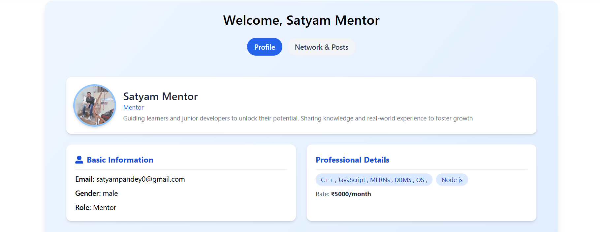
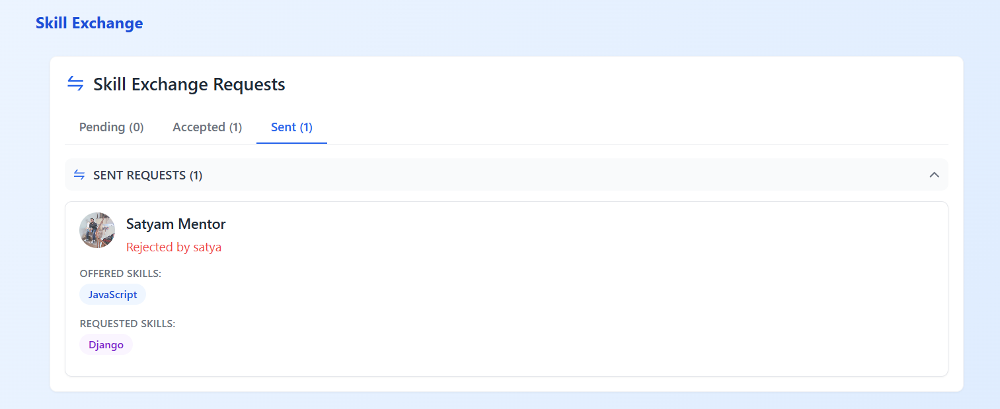
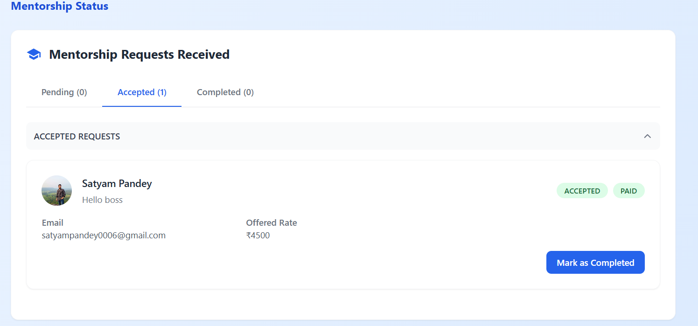
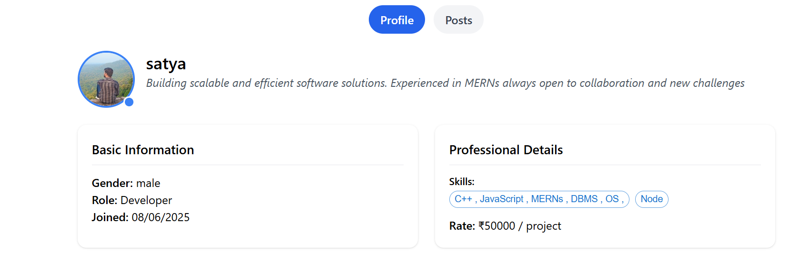

# Devsync

Devsync is a community-driven platform designed to empower college students, developers, mentors, and recruiters. It enables skill exchange, mentorship, collaboration, and project-based hiring — all in one place.

---

## 🚀 What is Devsync?

Devsync helps students and developers who may not have money but have skills, by allowing them to **exchange skills** and support each other. It also connects users with the right mentors for paid guidance. Recruiters and developers can find available talent for projects, communicate directly, and collaborate seamlessly.

---

## 🛠 Tech Stack

### Backend

- Node.js with Express  
- MongoDB (via Mongoose)  
- Authentication: JWT stored in HTTP-only cookies  
- Cloudinary for image storage  
- Razorpay & Stripe for payments  
- Other packages: bcrypt, cookie-parser, cors, gravatar, multer, multer-storage-cloudinary, dotenv, nodemon, crypto, jsonwebtoken  

### Frontend

- React.js (v19)  
- Tailwind CSS  
- MUI (Material UI) components and icons  
- React Router DOM for routing  
- Axios for API calls  
- React Toastify for notifications  
- Date-fns for date handling  
- Notistack for snackbars  
- ESLint with React hooks and React refresh plugins  
- Vite for build tooling  

---

## ✨ Features

- **Landing Page** – Welcome and navigation for users  
- **User Authentication** – Secure sign up/login with JWT  
- **Dashboard** – Personalized user overview  
- **Skill Exchange** – Request or offer skills to others  
- **Mentorship** – Find mentors, send requests, and get paid guidance  
- **Recruitment System** – Hire available developers for projects  
- **Availability Toggle** – Show your open/closed status for work  
- **Email Notification** – Receive developer emails once requests are accepted  
- **Follow / Unfollow** – Connect with other developers  
- **Posts & Comments** – Create posts, like/unlike, comment, and delete your own content  
- **Profile Page** – View your or others' profiles with posts and info  
- **Danger Zone** – Permanently delete your account  

---

## 📸 Screenshots

### Landing Page  


### Dashboard  


### Skill Exchange  


### Mentorship Requests  


### Profile Page  


---

## 💻 Installation & Setup

1. **Clone the repository**

    ```bash
    git clone https://github.com/satyam023/devsync.git
    cd devsync
    ```

2. **Backend setup**

    ```bash
    mkdir backend
    cd backend
    npm init -y
    npm install express mongoose cors jsonwebtoken cookie-parser dotenv bcrypt cloudinary gravatar multer multer-storage-cloudinary nodemon razorpay stripe crypto
    ```

3. **Frontend setup**

    ```bash
    npm create vite@latest frontend -- --template react
    cd frontend
    npm install @emotion/react @emotion/styled @mui/icons-material @mui/material axios date-fns notistack react react-dom react-icons react-router-dom react-toastify
    npm install --save-dev @eslint/js @types/react @types/react-dom @vitejs/plugin-react autoprefixer eslint eslint-plugin-react-hooks eslint-plugin-react-refresh globals postcss tailwindcss vite
    ```

4. **Configure environment variables**

    Create a `.env` file inside the `backend` folder with:

    ```
    MONGO_URI=your_mongodb_connection_string
    JWT_SECRET=your_jwt_secret
    PORT=5000
    CLOUDINARY_URL=your_cloudinary_url
    RAZORPAY_KEY=your_razorpay_key
    STRIPE_SECRET=your_stripe_secret_key
    ```

5. **Run the backend**

    ```bash
    cd backend
    npm start
    ```

6. **Run the frontend**

    ```bash
    cd ../frontend
    npm run dev
    ```

---

## 📈 Usage

- Register or log in to your account  
- Create or update your profile and skills  
- Browse and connect with other developers  
- Exchange skills or request mentorship  
- Post updates and interact via likes and comments  
- Toggle your availability for freelance projects  
- Receive email address when your requests are accepted  
- Manage your posts, comments, followers, and account  

---

## 🤝 Contributing

Contributions are welcome! Feel free to open issues or submit pull requests to help improve Devsync.

---

## 📧 Contact

For questions or feedback, please contact [satyampandey0006@gmail.com].
